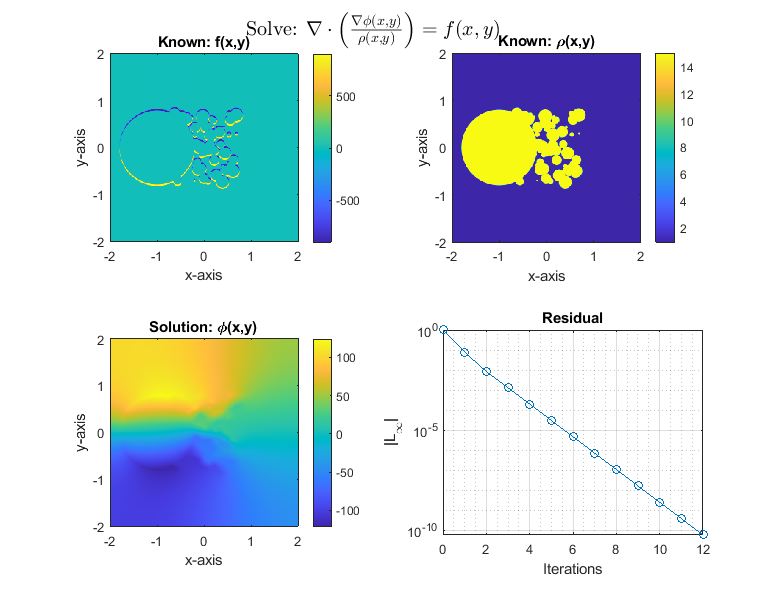

# Multigrid

    %%%%%%%%%%%%%%%%%%%%%%%%%%%%%%%%%%%%%%%%%%%%%%%%%%%%%%%%%%%%%%%%%%%%%%%%%%%%%%%%%%%%%%%%%%%%%%
    %
    % MULTIGRID: Calculates the variable coefficient poisson equation using V,W 
    % or F cycle in 2D with nuemnann boundary condition of d(phi(x,y))/d(n) 
    % equal to zero for M by M mesh points for equal dx and dy mesh size                                                                                                              
    % PDE being solved:
    % 
    %                                      yMMNNNNNNNNMd`     o                                     
    %                                .o:    sMm.     :y`   - .oo:    :o-                      `/+so`
    % -oooooooooooooooooo-         `yMd:     +MN-   /s    ym ms:N+   -dMh`                   sMmyo+`
    % `hMMMNmmmmmmmmmmNMh`        `mMo        :NM/`o+     M+ M+ sN     /Mm.                 sMy`    
    %   yMMm.        `hs          dMo          -mMh/      yh/Ny/ds      +Mm`  `........ `oyyMMhyyo  
    %    oMMN:      .do    `oo`  /MN            .o-        -/Nh/-        mM+  oddddddds `++mMy++/:  
    %     /NMN+    -d/     .hh.  yMy                         h:          sMd               NM.      
    %      :NMMo  /d:            hMs      oooooooooooooooooooooooooo     oMd  .-------.   :Md       
    %       .mMMyod.             oMd                .:/:`                yMy  +hhhhhhh/   yM+       
    %        `hMMh`              -MM.              sms+ym-              `NM:             .MN`       
    %         `//`                oMm.            :M/   Mo             .hMs              -y/        
    %                              +NNo.          +My::sm.           .oNNo                          
    %                               `/y+          oM/oo/`            /y+`                           
    %                                             yd                                                
    %
    %   • phi: 2D array of cell centered solution variable including ghost cells, containing 
    %   upon call the initial guess of the solution. Size = (M+2) x (N+2)
    %
    %   • f: 2D array of cell centered PDE right hand side including ghost cells (even 
    %   though these are not necessarily defined). Size = (M+2) x (N+2)
    %
    %   • rho: 2D array of cell centered PDE variable coefficents including ghost cells 
    %   (even though these are not necessarily defined). Size = (M+2) x (N+2)
    %
    %   • h: mesh spacing
    %
    %   • nIterMax: integer number of maximum V-cycle iterations to be performed
    %
    %   • alpha: convergence threshold for residual
    %
    %   • smoothCounts: Number of smoothing operations in pre and post smoothing
    %
    %   • cycleType: 1 for V-Cycle, 2 for F-Cycle and 3 for W-Cycle
    %
    % OutPuts:
    %   • phi: 2D array of cell centered solution variable including ghost cells, containing 
    %   the solution
    %
    %   • err: error code. Set to 0 if solution converged and no errors occurred, set to 1 
    %   if the solution did not converge.
    %
    %   • resid: array of residuals for each iteration
    %
    % Note:
    %   • Ensure prime factors of M and N is mostly comprised of 2. Any non-two 
    %   factors will slow down convergence. 
    %
    % Author: Adil Ansari, MS
    % 
    %%%%%%%%%%%%%%%%%%%%%%%%%%%%%%%%%%%%%%%%%%%%%%%%%%%%%%%%%%%%%%%%%%%%%%%%%%%%%%%%
